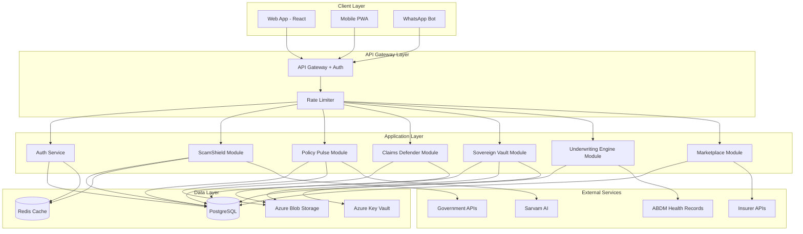
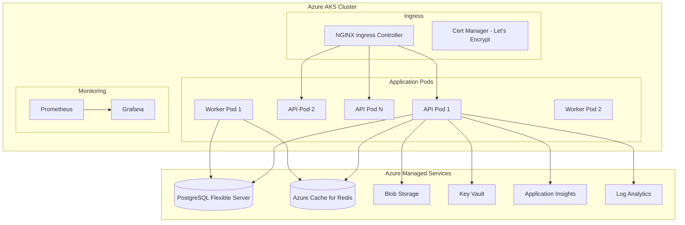

# Design Document: SageSure India Platform

## Overview

The SageSure India Platform is a comprehensive AI-powered trust and workflow platform for India's insurance ecosystem. The platform architecture follows a microservices-inspired modular design with six core modules, each addressing specific pain points in the insurance value chain.

The platform is built on a modern cloud-native stack using Azure Kubernetes Service (AKS) for orchestration, PostgreSQL for persistent storage, Redis for caching, and integrates with multiple external services including Sarvam AI for language processing, ABDM for health records, and government systems (1930, TRAI Chakshu, IRDAI Bima Bharosa).

The design prioritizes security (AES-256 encryption, TLS 1.3), compliance (IRDAI, DPDP Act 2023), scalability (10,000+ concurrent users), and performance (sub-2-second API responses). The architecture supports phased rollout with ScamShield and Policy Pulse in Phase 1, Claims Defender and Sovereign Vault in Phase 2, and Underwriting Engine and Marketplace in Phase 3.

## Architecture

### High-Level Architecture




### Technology Stack

**Frontend:**
- React 18 with TypeScript for type safety
- TailwindCSS for utility-first styling
- React Router v6 for client-side routing
- Axios for HTTP requests with interceptors
- React Query for server state management and caching
- React Hook Form for form handling and validation
- Zustand for lightweight client state management

**Backend:**
- Node.js 18 LTS with Express.js framework
- TypeScript for type safety across the stack
- PostgreSQL 15 for relational data storage
- Prisma ORM for type-safe database access
- Redis 7 for caching and session storage
- Bull for background job processing
- Winston for structured logging
- Joi for request validation

**AI/ML:**
- Sarvam AI API for Hindi/regional language LLM
- Custom deepfake detection model (TensorFlow.js)
- Pattern matching engine for scam detection
- Vector similarity search for ombudsman precedents (pgvector)

**Infrastructure:**
- Azure Kubernetes Service (AKS) for container orchestration
- Azure Container Registry for Docker images
- Azure Blob Storage for document storage
- Azure Key Vault for secrets management
- Azure Application Insights for monitoring
- Azure Log Analytics for centralized logging
- Azure PostgreSQL Flexible Server
- Azure Cache for Redis

**Security:**
- JWT for authentication with RS256 signing
- bcrypt for password hashing (12 rounds)
- AES-256-GCM for document encryption
- TLS 1.3 for data in transit
- Helmet.js for HTTP security headers
- Rate limiting with express-rate-limit
- CORS with whitelist configuration

### Deployment Architecture



**Scaling Strategy:**
- Horizontal Pod Autoscaler (HPA): 2-10 pods based on CPU (70%) and memory (80%)
- Database connection pooling: 10-50 connections per pod
- Redis cluster mode for high availability
- CDN for static assets (Azure Front Door)
- Read replicas for PostgreSQL in secondary region


## Components and Interfaces

### 1. Authentication Service

**Responsibilities:**
- User registration and login
- JWT token generation and validation
- Multi-factor authentication (OTP)
- Role-based access control (RBAC)
- Session management

**Key Interfaces:**

```typescript
interface AuthService {
  register(email: string, password: string, role: UserRole): Promise<User>;
  login(email: string, password: string): Promise<AuthTokens>;
  refreshToken(refreshToken: string): Promise<AuthTokens>;
  logout(userId: string): Promise<void>;
  sendOTP(userId: string): Promise<void>;
  verifyOTP(userId: string, otp: string): Promise<boolean>;
  validateToken(token: string): Promise<TokenPayload>;
}

interface AuthTokens {
  accessToken: string;  // JWT, 24h expiry
  refreshToken: string; // JWT, 30d expiry
}

interface TokenPayload {
  userId: string;
  email: string;
  role: UserRole;
  iat: number;
  exp: number;
}

enum UserRole {
  CONSUMER = 'CONSUMER',
  BROKER = 'BROKER',
  AGENT = 'AGENT',
  INSURER = 'INSURER',
  REGULATOR = 'REGULATOR',
  ADMIN = 'ADMIN'
}
```

**Implementation Details:**
- Passwords hashed with bcrypt (12 rounds)
- JWT signed with RS256 using private key from Azure Key Vault
- OTP sent via SMS using Twilio/MSG91 with 5-minute expiry
- Failed login attempts tracked with exponential backoff (5 attempts = 15min lockout)
- Refresh tokens stored in Redis with user ID as key

### 2. ScamShield Module

**Responsibilities:**
- Real-time scam detection via pattern matching
- Deepfake detection for video calls
- Telemarketer verification against TRAI DND
- Family alert system
- 1930 helpline integration
- WhatsApp bot message analysis

**Key Interfaces:**

```typescript
interface ScamShieldService {
  analyzeMessage(message: string, userId: string): Promise<ScamAnalysis>;
  analyzePhoneNumber(phoneNumber: string): Promise<PhoneVerification>;
  analyzeVideo(videoUrl: string): Promise<DeepfakeAnalysis>;
  verifyBrand(brandName: string): Promise<BrandVerification>;
  report1930(incident: ScamIncident): Promise<ReportStatus>;
  sendFamilyAlert(userId: string, alert: ScamAlert): Promise<void>;
}

interface ScamAnalysis {
  riskScore: number;        // 0-100
  isScam: boolean;          // true if riskScore > 70
  matchedPatterns: string[];
  warnings: string[];
  recommendations: string[];
  confidence: number;       // 0-100
}

interface DeepfakeAnalysis {
  isDeepfake: boolean;
  confidence: number;       // 0-100
  anomalies: {
    facialInconsistencies: string[];
    audioVisualSync: boolean;
    backgroundAnomalies: string[];
  };
  suspiciousFrames: number[];
}

interface PhoneVerification {
  isVerified: boolean;
  isDND: boolean;
  isKnownScammer: boolean;
  brandName?: string;
  warnings: string[];
}

interface ScamIncident {
  userId: string;
  scamType: string;
  dateTime: Date;
  scammerContact: string;
  amountInvolved?: number;
  description: string;
  evidence: string[];      // URLs to uploaded evidence
}
```

**Implementation Details:**
- Pattern matching using PostgreSQL full-text search with GIN index
- 10,000+ scam patterns stored in `scam_patterns` table with categories
- Deepfake detection using pre-trained TensorFlow.js model (MobileNetV2 backbone)
- Video analysis: extract frames at 1fps, analyze facial landmarks, check audio-visual sync
- TRAI DND registry cached in Redis, refreshed weekly
- 1930 API integration with retry logic (3 attempts with exponential backoff)
- WhatsApp bot using Twilio WhatsApp Business API
- Family alerts sent via SMS (Twilio) and WhatsApp with rate limiting (max 5 alerts/day)


### 3. Policy Pulse Module

**Responsibilities:**
- PDF policy parsing and text extraction
- Plain language translation (Hindi/regional languages)
- Red flag detection for mis-selling
- Coverage comparison across insurers
- Policy ontology normalization

**Key Interfaces:**

```typescript
interface PolicyPulseService {
  uploadPolicy(file: Buffer, userId: string): Promise<Policy>;
  parsePolicy(policyId: string): Promise<ParsedPolicy>;
  translatePolicy(policyId: string, language: Language): Promise<Translation>;
  detectRedFlags(policyId: string): Promise<RedFlagReport>;
  comparePolices(policyId: string): Promise<ComparisonReport>;
  askQuestion(policyId: string, question: string, language: Language): Promise<string>;
}

interface ParsedPolicy {
  policyId: string;
  metadata: {
    insurerName: string;
    policyNumber: string;
    issueDate: Date;
    expiryDate: Date;
    sumAssured: number;
    premium: number;
  };
  sections: {
    coverage: string;
    exclusions: string[];
    terms: string;
    conditions: string;
  };
  extractedData: {
    waitingPeriods: WaitingPeriod[];
    subLimits: SubLimit[];
    coPayment: number;
    roomRentLimit: number;
  };
}

interface Translation {
  language: Language;
  summary: string;
  keyPoints: string[];
  exclusionsHighlight: string[];
  simplifiedTerms: Record<string, string>;
  disclaimer: string;
}

interface RedFlagReport {
  overallRisk: 'LOW' | 'MEDIUM' | 'HIGH';
  redFlags: RedFlag[];
  recommendations: string[];
  misSellingSuspicion: boolean;
}

interface RedFlag {
  type: 'EXCESSIVE_EXCLUSIONS' | 'LONG_WAITING_PERIOD' | 'LOW_SUB_LIMITS' | 
        'HIGH_PREMIUM' | 'SHORT_TERM' | 'HIGH_COPAYMENT' | 'LOW_ROOM_RENT' | 
        'MISSING_COMMISSION';
  severity: 'LOW' | 'MEDIUM' | 'HIGH';
  description: string;
  policyClause: string;
  recommendation: string;
}

interface ComparisonReport {
  userPolicy: PolicySummary;
  similarPolicies: PolicySummary[];
  comparison: {
    premiumDifference: number;
    coverageGaps: string[];
    betterFeatures: string[];
    worseFeatures: string[];
  };
  switchingRecommendation: {
    shouldSwitch: boolean;
    estimatedSavings?: number;
    improvedCoverage?: string[];
  };
}

enum Language {
  ENGLISH = 'en',
  HINDI = 'hi',
  TAMIL = 'ta',
  TELUGU = 'te',
  MARATHI = 'mr',
  BENGALI = 'bn',
  GUJARATI = 'gu'
}
```

**Implementation Details:**
- PDF parsing using pdf-parse library with fallback to Tesseract OCR for scanned documents
- Text extraction with section identification using regex patterns and NLP
- Translation via Sarvam AI API with caching (Redis, 7-day TTL)
- Red flag detection using rule-based engine with 20+ rules
- Policy ontology stored in `policy_ontology` table with normalized coverage features
- Comparison engine uses vector similarity (pgvector) to find similar policies
- Q&A powered by Sarvam AI with policy context injection
- Original PDFs stored in Azure Blob Storage with encryption
- Parsed data cached in Redis for 24 hours


### 4. Claims Defender Module

**Responsibilities:**
- Claim denial analysis and reason extraction
- Ombudsman precedent matching
- Evidence packaging automation
- Timeline tracking and escalation
- Legal document generation

**Key Interfaces:**

```typescript
interface ClaimsDefenderService {
  analyzeDenial(denialLetter: Buffer, userId: string): Promise<DenialAnalysis>;
  searchPrecedents(denialAnalysis: DenialAnalysis): Promise<Precedent[]>;
  packageEvidence(claimId: string): Promise<EvidencePackage>;
  generateComplaint(claimId: string): Promise<ComplaintDraft>;
  trackTimeline(claimId: string): Promise<Timeline>;
  updateStatus(claimId: string, status: ClaimStatus): Promise<void>;
}

interface DenialAnalysis {
  claimId: string;
  denialReason: DenialReason;
  denialCategory: 'DOCUMENTATION' | 'EXCLUSION' | 'WAITING_PERIOD' | 
                  'PRE_EXISTING' | 'NON_DISCLOSURE' | 'OTHER';
  explanation: string;
  policyClauseReferences: string[];
  isJustified: boolean;
  successProbability: number;  // 0-100
  recommendation: 'CHALLENGE' | 'NEGOTIATE' | 'ACCEPT';
  missingDocuments: string[];
  timelineViolations: string[];
}

interface Precedent {
  caseId: string;
  summary: string;
  denialReason: string;
  policyType: string;
  insurer: string;
  claimAmount: number;
  ombudsmanDecision: 'FAVOR_POLICYHOLDER' | 'FAVOR_INSURER' | 'PARTIAL';
  reasoning: string;
  keyArguments: string[];
  legalPrinciples: string[];
  irdaiGuidelines: string[];
  relevanceScore: number;  // 0-100
  dateDecided: Date;
}

interface EvidencePackage {
  claimId: string;
  checklist: EvidenceItem[];
  completeness: number;  // 0-100
  missingItems: string[];
  uploadedDocuments: Document[];
}

interface EvidenceItem {
  category: 'POLICY' | 'CLAIM_FORM' | 'DENIAL_LETTER' | 'MEDICAL_RECORDS' | 
            'CORRESPONDENCE' | 'OTHER';
  description: string;
  required: boolean;
  uploaded: boolean;
  documentId?: string;
}

interface ComplaintDraft {
  claimId: string;
  ombudsmanOffice: string;
  complaintText: string;
  caseSummary: string;
  groundsForComplaint: string[];
  reliefSought: string;
  citedPrecedents: string[];
  citedClauses: string[];
  citedGuidelines: string[];
  attachments: string[];
}

interface Timeline {
  claimId: string;
  milestones: Milestone[];
  nextDeadline?: Date;
  upcomingReminders: Reminder[];
}

interface Milestone {
  date: Date;
  event: string;
  status: 'COMPLETED' | 'PENDING' | 'OVERDUE';
  notes?: string;
}
```

**Implementation Details:**
- Denial letter parsing using pdf-parse and NLP for reason extraction
- Precedent database with 1,000+ cases stored in PostgreSQL
- Vector embeddings (pgvector) for semantic precedent search
- Evidence checklist generated based on denial category and policy type
- Complaint generation using templates with dynamic content injection
- Timeline tracking with Bull jobs for reminder scheduling
- Ombudsman office selection based on insurer location and claim amount
- Success probability calculated using logistic regression model trained on historical outcomes


### 5. Sovereign Vault Module

**Responsibilities:**
- Encrypted document storage and retrieval
- Family access control with granular permissions
- Legacy heartbeat monitoring
- Automatic beneficiary notifications
- Document versioning and audit trail

**Key Interfaces:**

```typescript
interface SovereignVaultService {
  uploadDocument(file: Buffer, metadata: DocumentMetadata, userId: string): Promise<Document>;
  getDocument(documentId: string, userId: string): Promise<Buffer>;
  shareDocument(documentId: string, familyMemberId: string, permissions: Permission[]): Promise<void>;
  addFamilyMember(userId: string, member: FamilyMemberInvite): Promise<void>;
  revokeAccess(userId: string, familyMemberId: string): Promise<void>;
  checkHeartbeat(userId: string): Promise<void>;
  initiateLegacyProtocol(userId: string): Promise<void>;
  grantBeneficiaryAccess(userId: string, beneficiaryId: string, proof: DeathProof): Promise<void>;
}

interface Document {
  documentId: string;
  userId: string;
  filename: string;
  documentType: DocumentType;
  fileSize: number;
  encryptionKeyId: string;
  blobUrl: string;
  uploadDate: Date;
  version: number;
  tags: string[];
  metadata: Record<string, any>;
}

interface DocumentMetadata {
  filename: string;
  documentType: DocumentType;
  tags?: string[];
  customMetadata?: Record<string, any>;
}

enum DocumentType {
  POLICY = 'POLICY',
  CLAIM_FORM = 'CLAIM_FORM',
  MEDICAL_RECORD = 'MEDICAL_RECORD',
  ID_PROOF = 'ID_PROOF',
  FINANCIAL = 'FINANCIAL',
  OTHER = 'OTHER'
}

enum Permission {
  VIEW = 'VIEW',
  DOWNLOAD = 'DOWNLOAD',
  UPLOAD = 'UPLOAD',
  FULL_ACCESS = 'FULL_ACCESS'
}

interface FamilyMemberInvite {
  email: string;
  phone: string;
  name: string;
  relationship: string;
  permissions: Permission[];
  documentAccess: 'ALL' | 'CATEGORY' | 'SPECIFIC';
  allowedCategories?: DocumentType[];
  allowedDocuments?: string[];
}

interface HeartbeatConfig {
  userId: string;
  frequency: 'WEEKLY' | 'BIWEEKLY' | 'MONTHLY';
  lastCheckIn: Date;
  missedCheckIns: number;
  beneficiaries: Beneficiary[];
}

interface Beneficiary {
  name: string;
  email: string;
  phone: string;
  relationship: string;
  notificationSent: boolean;
  accessGranted: boolean;
}

interface DeathProof {
  deathCertificate: Buffer;
  identityProof: Buffer;
  relationship: string;
}
```

**Implementation Details:**
- Documents encrypted with AES-256-GCM before upload to Azure Blob Storage
- Unique encryption key per document, stored in Azure Key Vault
- Encryption keys never leave Key Vault (encrypt/decrypt operations via API)
- Document metadata stored in PostgreSQL with encrypted sensitive fields
- Family member invitations sent via email with secure token (24h expiry)
- Permission checks enforced at API layer before document access
- Heartbeat reminders scheduled using Bull jobs
- Legacy protocol triggered after 3 missed check-ins
- Beneficiary verification requires manual admin approval with document review
- Audit trail logged for all document access and permission changes
- Document versioning: up to 5 versions per document, older versions archived
- Soft delete: documents moved to trash for 30 days before permanent deletion


### 6. Underwriting Engine Module

**Responsibilities:**
- ABDM health data integration
- Pre-claim denial prediction
- Fraud detection for insurers
- Risk scoring
- Medical history analysis

**Key Interfaces:**

```typescript
interface UnderwritingEngineService {
  syncABDM(userId: string, consentToken: string): Promise<HealthProfile>;
  predictDenial(claimDetails: ClaimDetails): Promise<DenialPrediction>;
  detectFraud(claim: ClaimData): Promise<FraudAnalysis>;
  calculateRiskScore(userId: string): Promise<RiskScore>;
  analyzeHealthRecords(healthProfile: HealthProfile): Promise<HealthAnalysis>;
}

interface HealthProfile {
  userId: string;
  abdmHealthId: string;
  medicalHistory: MedicalRecord[];
  diagnoses: Diagnosis[];
  prescriptions: Prescription[];
  labResults: LabResult[];
  preExistingConditions: string[];
  lastSyncDate: Date;
  consentExpiry: Date;
}

interface MedicalRecord {
  recordId: string;
  date: Date;
  provider: string;
  recordType: string;
  summary: string;
  icd10Codes: string[];
}

interface DenialPrediction {
  claimId: string;
  denialProbability: number;  // 0-100
  confidence: number;         // 0-100
  riskFactors: RiskFactor[];
  recommendations: string[];
  estimatedApprovalTime?: number;  // days
  expectedPayout?: number;
}

interface RiskFactor {
  factor: string;
  severity: 'LOW' | 'MEDIUM' | 'HIGH';
  description: string;
  mitigation: string;
}

interface FraudAnalysis {
  claimId: string;
  fraudScore: number;  // 0-100
  isFraudulent: boolean;  // true if fraudScore > 70
  fraudPatterns: FraudPattern[];
  recommendation: 'APPROVE' | 'INVESTIGATE' | 'REJECT';
  linkedClaims: string[];
}

interface FraudPattern {
  patternType: 'DUPLICATE' | 'INFLATED' | 'SUSPICIOUS_TIMING' | 
                'PROVIDER_COLLUSION' | 'MEDICAL_INCONSISTENCY';
  description: string;
  confidence: number;
  evidence: string[];
}

interface RiskScore {
  userId: string;
  overallScore: number;  // 0-100
  breakdown: {
    medicalHistory: number;
    age: number;
    lifestyle: number;
    familyHistory: number;
  };
  preExistingConditions: string[];
  recommendations: string[];
}

interface ClaimDetails {
  policyId: string;
  claimAmount: number;
  claimType: string;
  diagnosis: string;
  treatmentDate: Date;
  hospitalName: string;
  documents: string[];
}
```

**Implementation Details:**
- ABDM integration using Health Information Provider (HIP) and Health Information User (HIU) APIs
- Consent management via ABDM Consent Manager with token-based authorization
- Health records parsed and normalized into FHIR-compatible format
- Pre-existing conditions identified using ICD-10 code mapping
- Denial prediction using Random Forest model trained on 10,000+ historical claims
- Model features: policy age, claim amount, diagnosis, waiting period status, documentation completeness
- Fraud detection using Isolation Forest for anomaly detection
- Fraud patterns identified through rule-based engine and ML clustering
- Risk scoring combines medical history, age, lifestyle factors with weighted algorithm
- ABDM data stored encrypted with separate consent records
- Consent expiry monitored with automatic renewal reminders
- API for insurers rate-limited to 1,000 requests/hour per insurer
- Fraud intelligence reports generated monthly with anonymized data


### 7. Marketplace Module

**Responsibilities:**
- Multi-insurer quote aggregation
- Policy purchase workflow
- Agent network management
- Commission transparency
- Renewal management

**Key Interfaces:**

```typescript
interface MarketplaceService {
  getQuotes(request: QuoteRequest): Promise<Quote[]>;
  compareQuotes(quoteIds: string[]): Promise<QuoteComparison>;
  purchasePolicy(quoteId: string, details: PurchaseDetails): Promise<PolicyPurchase>;
  findAgents(location: string, specialization: string): Promise<Agent[]>;
  trackApplication(applicationId: string): Promise<ApplicationStatus>;
  renewPolicy(policyId: string): Promise<RenewalQuote>;
}

interface QuoteRequest {
  coverageType: 'HEALTH' | 'LIFE' | 'MOTOR' | 'TERM';
  sumAssured: number;
  age: number;
  location: string;
  medicalHistory?: string[];
  additionalDetails?: Record<string, any>;
}

interface Quote {
  quoteId: string;
  insurerId: string;
  insurerName: string;
  premium: number;
  sumAssured: number;
  coverageFeatures: string[];
  exclusions: string[];
  waitingPeriods: WaitingPeriod[];
  claimSettlementRatio: number;
  insurerRating: number;
  validUntil: Date;
  policyTerms: string;
}

interface QuoteComparison {
  quotes: Quote[];
  bestValue: string;  // quoteId
  comparison: {
    premiumRange: { min: number; max: number };
    coverageComparison: Record<string, boolean[]>;
    exclusionComparison: string[][];
  };
  recommendation: string;
}

interface PurchaseDetails {
  personalDetails: PersonalInfo;
  nomineeDetails: NomineeInfo;
  medicalDeclarations: MedicalDeclaration[];
  agentId?: string;
  paymentMethod: string;
}

interface Agent {
  agentId: string;
  name: string;
  certifications: string[];
  specializations: string[];
  rating: number;
  reviewCount: number;
  location: string;
  commissionRate: number;
  contactInfo: {
    phone: string;
    email: string;
  };
}

interface PolicyPurchase {
  applicationId: string;
  policyId?: string;
  status: 'SUBMITTED' | 'UNDER_REVIEW' | 'APPROVED' | 'REJECTED' | 'ISSUED';
  insurerId: string;
  premium: number;
  agentCommission?: number;
  estimatedIssuanceDate?: Date;
  rejectionReason?: string;
}

interface ApplicationStatus {
  applicationId: string;
  currentStatus: string;
  timeline: {
    submitted: Date;
    underReview?: Date;
    approved?: Date;
    issued?: Date;
  };
  nextSteps: string[];
}
```

**Implementation Details:**
- Quote aggregation via REST APIs to 8+ partner insurers
- API calls made in parallel with 30-second timeout
- Quote normalization using policy ontology mapping
- Quotes cached in Redis for 24 hours with insurer ID + request hash as key
- Agent certification tracked with expiry dates and renewal reminders
- Agent ratings calculated from user reviews with weighted average (recent reviews weighted higher)
- Commission disclosure mandatory before purchase completion
- Purchase workflow: collect info → validate → submit to insurer → track status
- Application status polled from insurer APIs every 6 hours
- Policy documents automatically stored in Sovereign Vault upon issuance
- Renewal reminders sent 30 days before expiry via email, SMS, WhatsApp
- Renewal quotes fetched from current insurer and 3 competitors
- Agent performance metrics: conversion rate, customer satisfaction, compliance score
- Agent decertification triggered by: rating < 3.0, compliance violations, customer complaints > 5


## Data Models

### Core Tables

```sql
-- Users and Authentication
CREATE TABLE users (
  user_id UUID PRIMARY KEY DEFAULT gen_random_uuid(),
  email VARCHAR(255) UNIQUE NOT NULL,
  password_hash VARCHAR(255) NOT NULL,
  role VARCHAR(50) NOT NULL,
  phone VARCHAR(20),
  name VARCHAR(255),
  mfa_enabled BOOLEAN DEFAULT FALSE,
  mfa_secret VARCHAR(255),
  created_at TIMESTAMP DEFAULT NOW(),
  updated_at TIMESTAMP DEFAULT NOW(),
  last_login TIMESTAMP
);

CREATE TABLE refresh_tokens (
  token_id UUID PRIMARY KEY DEFAULT gen_random_uuid(),
  user_id UUID REFERENCES users(user_id) ON DELETE CASCADE,
  token_hash VARCHAR(255) NOT NULL,
  expires_at TIMESTAMP NOT NULL,
  created_at TIMESTAMP DEFAULT NOW()
);

CREATE TABLE audit_trail (
  audit_id UUID PRIMARY KEY DEFAULT gen_random_uuid(),
  user_id UUID REFERENCES users(user_id),
  action_type VARCHAR(100) NOT NULL,
  resource_type VARCHAR(100),
  resource_id VARCHAR(255),
  ip_address INET,
  user_agent TEXT,
  outcome VARCHAR(50),
  details JSONB,
  created_at TIMESTAMP DEFAULT NOW()
);

CREATE INDEX idx_audit_user_id ON audit_trail(user_id);
CREATE INDEX idx_audit_created_at ON audit_trail(created_at);
CREATE INDEX idx_audit_action_type ON audit_trail(action_type);

-- Consent Management (DPDP Compliance)
CREATE TABLE consent_log (
  consent_id UUID PRIMARY KEY DEFAULT gen_random_uuid(),
  user_id UUID REFERENCES users(user_id) ON DELETE CASCADE,
  purpose VARCHAR(255) NOT NULL,
  consent_given BOOLEAN NOT NULL,
  consent_text TEXT NOT NULL,
  granted_at TIMESTAMP,
  revoked_at TIMESTAMP,
  created_at TIMESTAMP DEFAULT NOW()
);

CREATE INDEX idx_consent_user_id ON consent_log(user_id);
```


### ScamShield Tables

```sql
CREATE TABLE scam_patterns (
  pattern_id UUID PRIMARY KEY DEFAULT gen_random_uuid(),
  pattern_text TEXT NOT NULL,
  pattern_category VARCHAR(100) NOT NULL,
  risk_level VARCHAR(20) NOT NULL,
  keywords TEXT[],
  regex_pattern TEXT,
  created_at TIMESTAMP DEFAULT NOW(),
  updated_at TIMESTAMP DEFAULT NOW()
);

CREATE INDEX idx_scam_patterns_category ON scam_patterns(pattern_category);
CREATE INDEX idx_scam_patterns_text ON scam_patterns USING GIN(to_tsvector('english', pattern_text));

CREATE TABLE digital_arrest_incidents (
  incident_id UUID PRIMARY KEY DEFAULT gen_random_uuid(),
  user_id UUID REFERENCES users(user_id),
  video_url TEXT,
  is_deepfake BOOLEAN,
  confidence_score DECIMAL(5,2),
  anomalies JSONB,
  scammer_contact VARCHAR(255),
  amount_involved DECIMAL(15,2),
  reported_to_1930 BOOLEAN DEFAULT FALSE,
  report_reference VARCHAR(100),
  created_at TIMESTAMP DEFAULT NOW()
);

CREATE TABLE telemarketer_registry (
  phone_number VARCHAR(20) PRIMARY KEY,
  brand_name VARCHAR(255),
  is_verified BOOLEAN DEFAULT FALSE,
  is_scammer BOOLEAN DEFAULT FALSE,
  is_dnd BOOLEAN DEFAULT FALSE,
  report_count INTEGER DEFAULT 0,
  last_verified TIMESTAMP,
  created_at TIMESTAMP DEFAULT NOW()
);

CREATE TABLE verified_brands (
  brand_id UUID PRIMARY KEY DEFAULT gen_random_uuid(),
  brand_name VARCHAR(255) UNIQUE NOT NULL,
  official_contacts JSONB,
  verification_status VARCHAR(50),
  verified_at TIMESTAMP,
  created_at TIMESTAMP DEFAULT NOW()
);

CREATE TABLE scam_reports (
  report_id UUID PRIMARY KEY DEFAULT gen_random_uuid(),
  user_id UUID REFERENCES users(user_id),
  scam_type VARCHAR(100) NOT NULL,
  scammer_contact VARCHAR(255),
  amount_involved DECIMAL(15,2),
  description TEXT,
  evidence_urls TEXT[],
  reported_to_1930 BOOLEAN DEFAULT FALSE,
  report_reference VARCHAR(100),
  status VARCHAR(50),
  created_at TIMESTAMP DEFAULT NOW()
);

CREATE TABLE family_alerts (
  alert_id UUID PRIMARY KEY DEFAULT gen_random_uuid(),
  user_id UUID REFERENCES users(user_id),
  family_member_id UUID REFERENCES users(user_id),
  alert_type VARCHAR(100),
  alert_message TEXT,
  sent_at TIMESTAMP DEFAULT NOW(),
  acknowledged BOOLEAN DEFAULT FALSE
);
```


### Policy Pulse Tables

```sql
CREATE TABLE policies (
  policy_id UUID PRIMARY KEY DEFAULT gen_random_uuid(),
  user_id UUID REFERENCES users(user_id) ON DELETE CASCADE,
  insurer_name VARCHAR(255) NOT NULL,
  policy_number VARCHAR(100) NOT NULL,
  policy_type VARCHAR(100) NOT NULL,
  issue_date DATE,
  expiry_date DATE,
  sum_assured DECIMAL(15,2),
  premium DECIMAL(15,2),
  original_pdf_url TEXT,
  parsed_data JSONB,
  created_at TIMESTAMP DEFAULT NOW(),
  updated_at TIMESTAMP DEFAULT NOW()
);

CREATE INDEX idx_policies_user_id ON policies(user_id);
CREATE INDEX idx_policies_expiry_date ON policies(expiry_date);

CREATE TABLE policy_ontology (
  ontology_id UUID PRIMARY KEY DEFAULT gen_random_uuid(),
  policy_id UUID REFERENCES policies(policy_id) ON DELETE CASCADE,
  coverage_features JSONB,
  exclusions TEXT[],
  waiting_periods JSONB,
  sub_limits JSONB,
  co_payment DECIMAL(5,2),
  room_rent_limit DECIMAL(10,2),
  normalized_at TIMESTAMP DEFAULT NOW()
);

CREATE TABLE policy_translations (
  translation_id UUID PRIMARY KEY DEFAULT gen_random_uuid(),
  policy_id UUID REFERENCES policies(policy_id) ON DELETE CASCADE,
  language VARCHAR(10) NOT NULL,
  summary TEXT,
  key_points TEXT[],
  exclusions_highlight TEXT[],
  simplified_terms JSONB,
  created_at TIMESTAMP DEFAULT NOW()
);

CREATE TABLE red_flags (
  flag_id UUID PRIMARY KEY DEFAULT gen_random_uuid(),
  policy_id UUID REFERENCES policies(policy_id) ON DELETE CASCADE,
  flag_type VARCHAR(100) NOT NULL,
  severity VARCHAR(20) NOT NULL,
  description TEXT,
  policy_clause TEXT,
  recommendation TEXT,
  detected_at TIMESTAMP DEFAULT NOW()
);

CREATE TABLE coverage_comparisons (
  comparison_id UUID PRIMARY KEY DEFAULT gen_random_uuid(),
  user_policy_id UUID REFERENCES policies(policy_id),
  compared_policies JSONB,
  comparison_data JSONB,
  recommendation JSONB,
  created_at TIMESTAMP DEFAULT NOW()
);
```


### Claims Defender Tables

```sql
CREATE TABLE claim_denials (
  denial_id UUID PRIMARY KEY DEFAULT gen_random_uuid(),
  user_id UUID REFERENCES users(user_id),
  policy_id UUID REFERENCES policies(policy_id),
  claim_amount DECIMAL(15,2),
  denial_reason TEXT,
  denial_category VARCHAR(100),
  denial_letter_url TEXT,
  is_justified BOOLEAN,
  success_probability DECIMAL(5,2),
  recommendation VARCHAR(50),
  missing_documents TEXT[],
  timeline_violations TEXT[],
  created_at TIMESTAMP DEFAULT NOW()
);

CREATE TABLE ombudsman_precedents (
  precedent_id UUID PRIMARY KEY DEFAULT gen_random_uuid(),
  case_id VARCHAR(100) UNIQUE NOT NULL,
  summary TEXT,
  denial_reason TEXT,
  policy_type VARCHAR(100),
  insurer VARCHAR(255),
  claim_amount DECIMAL(15,2),
  decision VARCHAR(50),
  reasoning TEXT,
  key_arguments TEXT[],
  legal_principles TEXT[],
  irdai_guidelines TEXT[],
  date_decided DATE,
  embedding vector(1536),  -- for semantic search
  created_at TIMESTAMP DEFAULT NOW()
);

CREATE INDEX idx_precedents_policy_type ON ombudsman_precedents(policy_type);
CREATE INDEX idx_precedents_insurer ON ombudsman_precedents(insurer);
CREATE INDEX idx_precedents_embedding ON ombudsman_precedents USING ivfflat (embedding vector_cosine_ops);

CREATE TABLE evidence_packages (
  package_id UUID PRIMARY KEY DEFAULT gen_random_uuid(),
  denial_id UUID REFERENCES claim_denials(denial_id) ON DELETE CASCADE,
  checklist JSONB,
  completeness DECIMAL(5,2),
  missing_items TEXT[],
  uploaded_documents JSONB,
  created_at TIMESTAMP DEFAULT NOW(),
  updated_at TIMESTAMP DEFAULT NOW()
);

CREATE TABLE dispute_timeline (
  timeline_id UUID PRIMARY KEY DEFAULT gen_random_uuid(),
  denial_id UUID REFERENCES claim_denials(denial_id) ON DELETE CASCADE,
  milestones JSONB,
  next_deadline TIMESTAMP,
  reminders JSONB,
  created_at TIMESTAMP DEFAULT NOW(),
  updated_at TIMESTAMP DEFAULT NOW()
);

CREATE TABLE complaint_drafts (
  draft_id UUID PRIMARY KEY DEFAULT gen_random_uuid(),
  denial_id UUID REFERENCES claim_denials(denial_id) ON DELETE CASCADE,
  ombudsman_office VARCHAR(255),
  complaint_text TEXT,
  case_summary TEXT,
  grounds_for_complaint TEXT[],
  relief_sought TEXT,
  cited_precedents TEXT[],
  cited_clauses TEXT[],
  cited_guidelines TEXT[],
  attachments TEXT[],
  created_at TIMESTAMP DEFAULT NOW()
);
```


### Sovereign Vault Tables

```sql
CREATE TABLE documents (
  document_id UUID PRIMARY KEY DEFAULT gen_random_uuid(),
  user_id UUID REFERENCES users(user_id) ON DELETE CASCADE,
  filename VARCHAR(255) NOT NULL,
  document_type VARCHAR(50) NOT NULL,
  file_size BIGINT,
  encryption_key_id VARCHAR(255) NOT NULL,
  blob_url TEXT NOT NULL,
  version INTEGER DEFAULT 1,
  tags TEXT[],
  metadata JSONB,
  is_deleted BOOLEAN DEFAULT FALSE,
  deleted_at TIMESTAMP,
  created_at TIMESTAMP DEFAULT NOW(),
  updated_at TIMESTAMP DEFAULT NOW()
);

CREATE INDEX idx_documents_user_id ON documents(user_id);
CREATE INDEX idx_documents_type ON documents(document_type);
CREATE INDEX idx_documents_tags ON documents USING GIN(tags);

CREATE TABLE family_members (
  family_member_id UUID PRIMARY KEY DEFAULT gen_random_uuid(),
  user_id UUID REFERENCES users(user_id) ON DELETE CASCADE,
  member_user_id UUID REFERENCES users(user_id),
  name VARCHAR(255),
  email VARCHAR(255),
  phone VARCHAR(20),
  relationship VARCHAR(100),
  invitation_token VARCHAR(255),
  invitation_sent_at TIMESTAMP,
  invitation_accepted_at TIMESTAMP,
  status VARCHAR(50),
  created_at TIMESTAMP DEFAULT NOW()
);

CREATE TABLE access_permissions (
  permission_id UUID PRIMARY KEY DEFAULT gen_random_uuid(),
  document_id UUID REFERENCES documents(document_id) ON DELETE CASCADE,
  family_member_id UUID REFERENCES family_members(family_member_id) ON DELETE CASCADE,
  permissions VARCHAR(50)[],
  granted_at TIMESTAMP DEFAULT NOW(),
  revoked_at TIMESTAMP
);

CREATE TABLE legacy_heartbeat (
  heartbeat_id UUID PRIMARY KEY DEFAULT gen_random_uuid(),
  user_id UUID REFERENCES users(user_id) ON DELETE CASCADE,
  frequency VARCHAR(20) NOT NULL,
  last_check_in TIMESTAMP,
  missed_check_ins INTEGER DEFAULT 0,
  legacy_protocol_initiated BOOLEAN DEFAULT FALSE,
  initiated_at TIMESTAMP,
  cancelled_at TIMESTAMP,
  created_at TIMESTAMP DEFAULT NOW(),
  updated_at TIMESTAMP DEFAULT NOW()
);

CREATE TABLE beneficiaries (
  beneficiary_id UUID PRIMARY KEY DEFAULT gen_random_uuid(),
  user_id UUID REFERENCES users(user_id) ON DELETE CASCADE,
  name VARCHAR(255) NOT NULL,
  email VARCHAR(255) NOT NULL,
  phone VARCHAR(20),
  relationship VARCHAR(100),
  notification_sent BOOLEAN DEFAULT FALSE,
  notification_sent_at TIMESTAMP,
  access_granted BOOLEAN DEFAULT FALSE,
  access_granted_at TIMESTAMP,
  death_certificate_url TEXT,
  identity_proof_url TEXT,
  created_at TIMESTAMP DEFAULT NOW()
);

CREATE TABLE document_access_log (
  log_id UUID PRIMARY KEY DEFAULT gen_random_uuid(),
  document_id UUID REFERENCES documents(document_id),
  user_id UUID REFERENCES users(user_id),
  access_type VARCHAR(50),
  ip_address INET,
  accessed_at TIMESTAMP DEFAULT NOW()
);
```


### Underwriting Engine Tables

```sql
CREATE TABLE health_profiles (
  profile_id UUID PRIMARY KEY DEFAULT gen_random_uuid(),
  user_id UUID REFERENCES users(user_id) ON DELETE CASCADE,
  abdm_health_id VARCHAR(255),
  medical_history JSONB,
  diagnoses JSONB,
  prescriptions JSONB,
  lab_results JSONB,
  pre_existing_conditions TEXT[],
  last_sync_date TIMESTAMP,
  consent_token VARCHAR(255),
  consent_expiry TIMESTAMP,
  created_at TIMESTAMP DEFAULT NOW(),
  updated_at TIMESTAMP DEFAULT NOW()
);

CREATE TABLE denial_predictions (
  prediction_id UUID PRIMARY KEY DEFAULT gen_random_uuid(),
  user_id UUID REFERENCES users(user_id),
  policy_id UUID REFERENCES policies(policy_id),
  claim_amount DECIMAL(15,2),
  claim_type VARCHAR(100),
  denial_probability DECIMAL(5,2),
  confidence DECIMAL(5,2),
  risk_factors JSONB,
  recommendations TEXT[],
  estimated_approval_time INTEGER,
  expected_payout DECIMAL(15,2),
  created_at TIMESTAMP DEFAULT NOW()
);

CREATE TABLE fraud_flags (
  flag_id UUID PRIMARY KEY DEFAULT gen_random_uuid(),
  claim_id VARCHAR(255),
  insurer_id UUID,
  fraud_score DECIMAL(5,2),
  is_fraudulent BOOLEAN,
  fraud_patterns JSONB,
  recommendation VARCHAR(50),
  linked_claims TEXT[],
  created_at TIMESTAMP DEFAULT NOW()
);

CREATE TABLE risk_scores (
  score_id UUID PRIMARY KEY DEFAULT gen_random_uuid(),
  user_id UUID REFERENCES users(user_id) ON DELETE CASCADE,
  overall_score DECIMAL(5,2),
  breakdown JSONB,
  pre_existing_conditions TEXT[],
  recommendations TEXT[],
  calculated_at TIMESTAMP DEFAULT NOW()
);
```


### Marketplace Tables

```sql
CREATE TABLE quotes (
  quote_id UUID PRIMARY KEY DEFAULT gen_random_uuid(),
  user_id UUID REFERENCES users(user_id),
  insurer_id VARCHAR(255) NOT NULL,
  insurer_name VARCHAR(255) NOT NULL,
  coverage_type VARCHAR(100) NOT NULL,
  premium DECIMAL(15,2) NOT NULL,
  sum_assured DECIMAL(15,2) NOT NULL,
  coverage_features JSONB,
  exclusions TEXT[],
  waiting_periods JSONB,
  claim_settlement_ratio DECIMAL(5,2),
  insurer_rating DECIMAL(3,2),
  valid_until TIMESTAMP NOT NULL,
  policy_terms TEXT,
  created_at TIMESTAMP DEFAULT NOW()
);

CREATE INDEX idx_quotes_user_id ON quotes(user_id);
CREATE INDEX idx_quotes_valid_until ON quotes(valid_until);

CREATE TABLE policies_purchased (
  purchase_id UUID PRIMARY KEY DEFAULT gen_random_uuid(),
  application_id VARCHAR(255) UNIQUE NOT NULL,
  user_id UUID REFERENCES users(user_id),
  quote_id UUID REFERENCES quotes(quote_id),
  policy_id UUID REFERENCES policies(policy_id),
  insurer_id VARCHAR(255) NOT NULL,
  agent_id UUID,
  status VARCHAR(50) NOT NULL,
  premium DECIMAL(15,2),
  agent_commission DECIMAL(15,2),
  personal_details JSONB,
  nominee_details JSONB,
  medical_declarations JSONB,
  payment_method VARCHAR(100),
  payment_status VARCHAR(50),
  submitted_at TIMESTAMP,
  approved_at TIMESTAMP,
  issued_at TIMESTAMP,
  rejection_reason TEXT,
  created_at TIMESTAMP DEFAULT NOW(),
  updated_at TIMESTAMP DEFAULT NOW()
);

CREATE TABLE agent_certifications (
  agent_id UUID PRIMARY KEY DEFAULT gen_random_uuid(),
  user_id UUID REFERENCES users(user_id) ON DELETE CASCADE,
  name VARCHAR(255) NOT NULL,
  certifications TEXT[],
  specializations TEXT[],
  location VARCHAR(255),
  commission_rate DECIMAL(5,2),
  rating DECIMAL(3,2),
  review_count INTEGER DEFAULT 0,
  phone VARCHAR(20),
  email VARCHAR(255),
  is_certified BOOLEAN DEFAULT TRUE,
  certification_expiry DATE,
  created_at TIMESTAMP DEFAULT NOW(),
  updated_at TIMESTAMP DEFAULT NOW()
);

CREATE TABLE agent_reviews (
  review_id UUID PRIMARY KEY DEFAULT gen_random_uuid(),
  agent_id UUID REFERENCES agent_certifications(agent_id) ON DELETE CASCADE,
  user_id UUID REFERENCES users(user_id),
  rating INTEGER CHECK (rating >= 1 AND rating <= 5),
  review_text TEXT,
  created_at TIMESTAMP DEFAULT NOW()
);

CREATE TABLE commission_records (
  record_id UUID PRIMARY KEY DEFAULT gen_random_uuid(),
  purchase_id UUID REFERENCES policies_purchased(purchase_id),
  agent_id UUID REFERENCES agent_certifications(agent_id),
  commission_amount DECIMAL(15,2),
  commission_rate DECIMAL(5,2),
  paid BOOLEAN DEFAULT FALSE,
  paid_at TIMESTAMP,
  created_at TIMESTAMP DEFAULT NOW()
);

CREATE TABLE policy_renewals (
  renewal_id UUID PRIMARY KEY DEFAULT gen_random_uuid(),
  policy_id UUID REFERENCES policies(policy_id) ON DELETE CASCADE,
  renewal_date DATE NOT NULL,
  reminder_sent BOOLEAN DEFAULT FALSE,
  reminder_sent_at TIMESTAMP,
  renewed BOOLEAN DEFAULT FALSE,
  renewed_at TIMESTAMP,
  new_policy_id UUID REFERENCES policies(policy_id),
  created_at TIMESTAMP DEFAULT NOW()
);
```


## Correctness Properties

*A property is a characteristic or behavior that should hold true across all valid executions of a system—essentially, a formal statement about what the system should do. Properties serve as the bridge between human-readable specifications and machine-verifiable correctness guarantees.*

### Property Reflection and Consolidation

After analyzing all acceptance criteria, several properties can be consolidated to avoid redundancy:

- **Encryption round-trip properties** (2.1, 13.1) can be combined into a single comprehensive document encryption property
- **Score validation properties** (3.2, 10.6, 11.3, 18.4) all validate that scores are in 0-100 range - can be combined
- **Performance properties** (3.1, 6.1, 7.1, 7.2, 11.4, 13.9, 16.3, 19.3, 23.1, 23.5, 27.2, 30.3) test response time bounds - can be grouped by module
- **Permission enforcement properties** (1.5, 1.7, 14.5, 14.6) test access control - can be combined
- **Rate limiting properties** (23.9, 23.10, 27.7) test rate limiting behavior - can be combined
- **Data deletion properties** (16.12, 22.6) test compliance with data deletion requirements - can be combined

The following properties represent the unique, non-redundant correctness guarantees for the platform:

### Authentication and Authorization Properties

**Property 1: Password encryption is irreversible**
*For any* user registration with email and password, the stored password hash should never match the plaintext password, and the same password should always produce a different hash due to salting.
**Validates: Requirements 1.1**

**Property 2: JWT token expiry enforcement**
*For any* issued JWT token, attempting to use it after 24 hours should result in authentication failure, and refresh tokens should successfully generate new valid access tokens.
**Validates: Requirements 1.2, 1.3**

**Property 3: Access control enforcement**
*For any* user and protected resource, accessing without authentication should return HTTP 401, and accessing beyond role permissions should return HTTP 403.
**Validates: Requirements 1.5, 1.7**

### Encryption and Security Properties

**Property 4: Document encryption round-trip**
*For any* document uploaded to the system, encrypting with AES-256 then decrypting should return the exact original document byte-for-byte.
**Validates: Requirements 2.1, 13.1**

**Property 5: Encryption key uniqueness**
*For any* two documents uploaded to the system, they should never share the same encryption key, even if uploaded by the same user.
**Validates: Requirements 2.3, 13.2**

### ScamShield Properties

**Property 6: Scam detection performance bounds**
*For any* text message submitted for analysis, the ScamShield should return a risk assessment within 2 seconds.
**Validates: Requirements 3.1**

**Property 7: Risk score validity**
*For any* scam analysis, risk score, success probability, relevance score, or fraud score returned by the system should be in the range 0-100 inclusive.
**Validates: Requirements 3.2, 10.6, 11.3, 18.4**

### Policy Pulse Properties

**Property 8: PDF parsing performance**
*For any* valid PDF policy document up to 50MB, text extraction should complete within 10 seconds.
**Validates: Requirements 6.1**

**Property 9: Policy data round-trip**
*For any* policy successfully parsed and stored, retrieving it from the database should return all extracted metadata fields with values matching the original parse.
**Validates: Requirements 6.9**

**Property 10: Translation performance**
*For any* parsed policy, generating a plain language summary in English should complete within 15 seconds, and translating to any supported language should complete within 20 seconds.
**Validates: Requirements 7.1, 7.2**

**Property 11: Red flag detection completeness**
*For any* policy analyzed, all 20+ red flag rules should be evaluated, and policies with >15 exclusions should always be flagged as high-risk.
**Validates: Requirements 8.1, 8.2**

### Claims Defender Properties

**Property 12: Precedent search performance**
*For any* claim denial analysis, searching and ranking ombudsman precedents should return the top 5 results within 5 seconds.
**Validates: Requirements 11.4**

**Property 13: Evidence completeness tracking**
*For any* evidence package, the completeness percentage should accurately reflect the ratio of uploaded documents to required documents in the checklist.
**Validates: Requirements 12.3**

### Sovereign Vault Properties

**Property 14: Document search performance**
*For any* search query in Sovereign Vault, results should be returned within 2 seconds regardless of query type (filename, tags, or content).
**Validates: Requirements 13.9**

**Property 15: Permission verification**
*For any* family member attempting to access a document, access should be granted only if their permission level includes the requested operation, otherwise access should be denied and logged.
**Validates: Requirements 14.5, 14.6**

**Property 16: Heartbeat state machine**
*For any* user with legacy heartbeat enabled, completing a check-in should reset the missed count to 0, and missing 3 consecutive check-ins should initiate the legacy protocol exactly once.
**Validates: Requirements 15.3, 15.5**

### Underwriting Engine Properties

**Property 17: ABDM integration performance**
*For any* authorized ABDM health record fetch, the operation should complete within 30 seconds of receiving the authorization token.
**Validates: Requirements 16.3**

**Property 18: Consent revocation enforcement**
*For any* user revoking ABDM consent or any data processing consent, all associated data should be deleted within the specified timeframe (24 hours for processing stop, 30 days for data deletion).
**Validates: Requirements 16.12, 22.5, 22.6**

**Property 19: Fraud detection threshold enforcement**
*For any* claim analyzed for fraud, claims with fraud risk score >70 should always be flagged for manual investigation, and claims with denial probability >50% should always have high-risk factors flagged.
**Validates: Requirements 17.5, 18.5**

### Marketplace Properties

**Property 20: Quote normalization performance**
*For any* set of insurer quote responses, normalization into standardized format should complete within 30 seconds.
**Validates: Requirements 19.3**

**Property 21: Quote caching behavior**
*For any* quote request, if an identical request was made within the past 24 hours, the cached result should be returned instead of making new API calls to insurers.
**Validates: Requirements 19.10**

**Property 22: Policy purchase integration**
*For any* policy successfully issued through the Marketplace, it should be automatically stored in Sovereign Vault with proper encryption and metadata.
**Validates: Requirements 20.9**

### Compliance and Audit Properties

**Property 23: Audit log completeness**
*For any* user action in the system, an audit log entry should be created with timestamp, user ID, action type, IP address, and outcome.
**Validates: Requirements 21.1**

**Property 24: Audit log immutability**
*For any* audit log entry created, attempting to modify it should fail, and the cryptographic hash should detect any tampering attempts.
**Validates: Requirements 21.5**

**Property 25: Data portability round-trip**
*For any* user requesting data export, the JSON export should contain all user data, and importing it into a test environment should recreate the user's complete data state.
**Validates: Requirements 22.7**

### Performance and Scalability Properties

**Property 26: API response time bounds**
*For any* API request under normal load, 95% of requests should complete within 2 seconds, and cache hits should complete within 200 milliseconds.
**Validates: Requirements 23.1, 23.5**

**Property 27: Rate limiting enforcement**
*For any* user making API requests, the 101st request within a 1-minute window should return HTTP 429 with a retry-after header, and the 11th notification in a day should be batched into a digest.
**Validates: Requirements 23.9, 23.10, 27.7**

### API Design Properties

**Property 28: HTTP status code consistency**
*For any* API endpoint, successful operations should return 2xx codes, client errors should return 4xx codes, and server errors should return 5xx codes, with error responses always including error code, message, and details in JSON format.
**Validates: Requirements 28.3, 28.4**

### Disaster Recovery Properties

**Property 29: Backup integrity verification**
*For any* database backup created, performing a test restoration should successfully recreate all data without corruption or loss.
**Validates: Requirements 29.4**

### Frontend Properties

**Property 30: Page load performance**
*For any* page in the application, initial content should be displayed within 3 seconds on a 4G connection.
**Validates: Requirements 30.3**

**Property 31: Form error handling**
*For any* form submission with validation errors, the first error field should receive focus, and each error should have a clear correction message displayed inline.
**Validates: Requirements 30.11**


## Error Handling

### Error Classification

The system implements a hierarchical error classification system:

**1. Client Errors (4xx)**
- **400 Bad Request**: Invalid input data, malformed JSON, validation failures
- **401 Unauthorized**: Missing or invalid authentication token
- **403 Forbidden**: Insufficient permissions for requested operation
- **404 Not Found**: Requested resource does not exist
- **409 Conflict**: Resource state conflict (e.g., duplicate registration)
- **429 Too Many Requests**: Rate limit exceeded

**2. Server Errors (5xx)**
- **500 Internal Server Error**: Unexpected server-side failures
- **502 Bad Gateway**: External service (ABDM, Sarvam AI, insurers) unavailable
- **503 Service Unavailable**: System maintenance or overload
- **504 Gateway Timeout**: External service timeout

### Error Response Format

All errors return consistent JSON structure:

```typescript
interface ErrorResponse {
  error: {
    code: string;           // Machine-readable error code (e.g., "INVALID_POLICY_PDF")
    message: string;        // Human-readable error message
    details?: any;          // Additional context (validation errors, stack trace in dev)
    timestamp: string;      // ISO 8601 timestamp
    requestId: string;      // Unique request ID for tracing
    path: string;           // API endpoint that generated the error
  }
}
```

### Error Handling Strategies

**1. Validation Errors**
- Input validation using Joi schemas at API layer
- Return 400 with specific field-level errors
- Example: `{ code: "VALIDATION_ERROR", details: { email: "Invalid email format" } }`

**2. Authentication/Authorization Errors**
- JWT validation middleware on all protected routes
- Return 401 for missing/invalid tokens, 403 for insufficient permissions
- Log all authentication failures for security monitoring

**3. External Service Failures**
- Circuit breaker pattern for external APIs (Sarvam AI, ABDM, insurers)
- Retry logic with exponential backoff (3 attempts, 1s, 2s, 4s delays)
- Fallback to cached data when available
- Return 502/504 with clear error messages

**4. Database Errors**
- Connection pool management with health checks
- Automatic retry for transient failures (deadlocks, connection drops)
- Transaction rollback on errors
- Log all database errors with query context

**5. File Processing Errors**
- PDF parsing failures: return 400 with guidance on supported formats
- OCR failures: prompt user for manual data entry
- File size limits: return 413 Payload Too Large
- Virus scanning: reject infected files with 400

**6. Rate Limiting**
- Return 429 with `Retry-After` header indicating wait time
- Provide clear message about rate limits in error response

**7. Timeout Handling**
- Set timeouts for all external API calls (30s default)
- Return 504 with partial results if available
- Queue long-running operations (PDF parsing, ML inference) for async processing

### Graceful Degradation

**ScamShield Module:**
- If deepfake detection model unavailable: fall back to pattern matching only
- If 1930 API down: save report locally and provide manual submission instructions

**Policy Pulse Module:**
- If Sarvam AI unavailable: return English summary only, queue translations
- If OCR fails: prompt user for manual data entry

**Claims Defender Module:**
- If precedent search slow: return cached top precedents
- If ombudsman API down: provide downloadable complaint package

**Marketplace Module:**
- If insurer API down: show cached quotes with staleness indicator
- If quote aggregation times out: show partial results from responsive insurers

### Logging and Monitoring

**Error Logging:**
- All errors logged to Azure Log Analytics with structured JSON
- Include: error code, message, stack trace, request context, user ID
- Severity levels: ERROR (failures), WARN (degraded), INFO (handled)

**Alerting:**
- Error rate >5% over 5 minutes: critical alert
- External service failures: warning alert
- Database connection pool >80%: warning alert
- Disk space >85%: critical alert

**Error Tracking:**
- Unique request IDs for distributed tracing
- Correlation IDs across microservices
- Error aggregation and deduplication
- Weekly error reports for proactive fixes


## Testing Strategy

### Dual Testing Approach

The platform employs a comprehensive testing strategy combining unit tests and property-based tests:

**Unit Tests:**
- Verify specific examples and edge cases
- Test integration points between components
- Validate error conditions and boundary cases
- Focus on concrete scenarios with known inputs/outputs

**Property-Based Tests:**
- Verify universal properties across all inputs
- Generate hundreds of random test cases per property
- Catch edge cases that manual testing might miss
- Provide mathematical confidence in correctness

Both approaches are complementary and necessary for comprehensive coverage. Unit tests catch concrete bugs in specific scenarios, while property tests verify general correctness across the input space.

### Property-Based Testing Configuration

**Framework Selection:**
- **Backend (TypeScript/Node.js)**: fast-check library
- **Frontend (React/TypeScript)**: fast-check with React Testing Library
- **Minimum iterations**: 100 runs per property test (due to randomization)
- **Seed management**: Fixed seeds for reproducible failures

**Test Organization:**
- Each correctness property from the design document maps to ONE property-based test
- Tests tagged with: `Feature: sagesure-india-platform, Property {number}: {property_text}`
- Example: `Feature: sagesure-india-platform, Property 4: Document encryption round-trip`

### Module-Specific Testing

**1. Authentication Service**

*Unit Tests:*
- Registration with valid/invalid email formats
- Login with correct/incorrect passwords
- JWT token generation and validation
- MFA OTP generation and verification
- Role-based access control for specific roles

*Property Tests:*
- Property 1: Password encryption irreversibility
- Property 2: JWT token expiry enforcement
- Property 3: Access control enforcement

**2. ScamShield Module**

*Unit Tests:*
- Specific known scam patterns detection
- Deepfake detection on sample videos
- TRAI DND registry lookup for known numbers
- 1930 report generation with sample data
- Family alert notification delivery

*Property Tests:*
- Property 6: Scam detection performance bounds
- Property 7: Risk score validity (0-100 range)

**3. Policy Pulse Module**

*Unit Tests:*
- PDF parsing for specific insurer formats
- OCR on sample scanned documents
- Translation for specific policy texts
- Red flag detection for known problematic policies
- Coverage comparison for sample policies

*Property Tests:*
- Property 8: PDF parsing performance
- Property 9: Policy data round-trip
- Property 10: Translation performance
- Property 11: Red flag detection completeness

**4. Claims Defender Module**

*Unit Tests:*
- Denial reason extraction from sample letters
- Precedent matching for specific denial types
- Evidence checklist generation for known categories
- Complaint draft generation with sample data

*Property Tests:*
- Property 12: Precedent search performance
- Property 13: Evidence completeness tracking

**5. Sovereign Vault Module**

*Unit Tests:*
- Document upload/download for specific file types
- Family member invitation flow
- Permission grant/revoke for specific scenarios
- Heartbeat check-in and missed check-in handling
- Legacy protocol initiation

*Property Tests:*
- Property 4: Document encryption round-trip
- Property 5: Encryption key uniqueness
- Property 14: Document search performance
- Property 15: Permission verification
- Property 16: Heartbeat state machine

**6. Underwriting Engine Module**

*Unit Tests:*
- ABDM health record parsing for sample data
- Pre-existing condition identification from ICD-10 codes
- Denial prediction for specific claim scenarios
- Fraud pattern detection for known fraud cases
- Risk score calculation for sample health profiles

*Property Tests:*
- Property 17: ABDM integration performance
- Property 18: Consent revocation enforcement
- Property 19: Fraud detection threshold enforcement

**7. Marketplace Module**

*Unit Tests:*
- Quote aggregation from sample insurer responses
- Quote normalization for specific formats
- Agent matching for specific locations
- Policy purchase workflow with sample data
- Renewal reminder generation

*Property Tests:*
- Property 20: Quote normalization performance
- Property 21: Quote caching behavior
- Property 22: Policy purchase integration

### Integration Testing

**API Integration Tests:**
- End-to-end flows: registration → login → policy upload → analysis
- Cross-module integration: Marketplace → Sovereign Vault
- External service mocking: Sarvam AI, ABDM, insurer APIs
- Database transaction integrity
- Error propagation across modules

**Performance Testing:**
- Load testing: 10,000 concurrent users
- Stress testing: gradual load increase to breaking point
- Spike testing: sudden traffic surges
- Endurance testing: sustained load over 24 hours
- API response time validation (95th percentile < 2s)

**Security Testing:**
- Penetration testing: OWASP Top 10 vulnerabilities
- Authentication bypass attempts
- SQL injection and XSS prevention
- Rate limiting effectiveness
- Encryption strength validation
- RBAC enforcement across all endpoints

### Compliance Testing

**IRDAI Compliance:**
- Audit trail completeness verification
- 7-year data retention validation
- Policyholder protection rules adherence
- Fraud monitoring framework compliance

**DPDP Act 2023 Compliance:**
- Consent management workflow testing
- Data deletion within 30 days verification
- Data portability export/import validation
- Breach notification timing (72 hours)

### Test Automation

**CI/CD Pipeline:**
- Automated test execution on every commit
- Unit tests: run in <5 minutes
- Property tests: run in <15 minutes
- Integration tests: run in <30 minutes
- Deployment blocked if any test fails

**Test Coverage Goals:**
- Unit test coverage: >80% for all modules
- Property test coverage: 100% of design properties
- Integration test coverage: all critical user flows
- API endpoint coverage: 100% of public APIs

### Test Data Management

**Synthetic Data Generation:**
- fast-check generators for all domain types
- Realistic policy documents (50+ insurer formats)
- Scam pattern database (10,000+ patterns)
- Ombudsman precedent database (1,000+ cases)
- Health records in FHIR format

**Test Environment:**
- Isolated test database with seed data
- Mocked external services (Sarvam AI, ABDM, insurers)
- Sandbox Azure resources (Key Vault, Blob Storage)
- Test user accounts for each role type

### Monitoring and Observability in Production

**Real User Monitoring:**
- Frontend performance metrics (page load, interaction time)
- API response times per endpoint
- Error rates by module and error type
- User journey completion rates

**Synthetic Monitoring:**
- Automated health checks every 5 minutes
- Critical user flow simulation every 15 minutes
- External service availability checks
- Alert on 3 consecutive failures

**Chaos Engineering:**
- Quarterly chaos experiments
- Random pod termination
- Network latency injection
- Database connection failures
- External service outages
